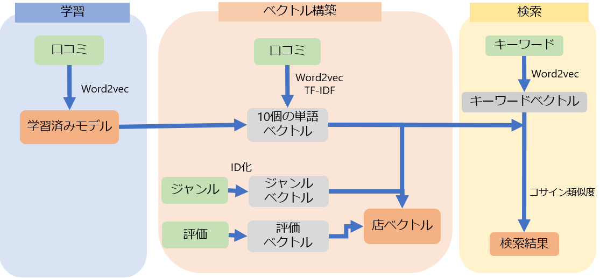
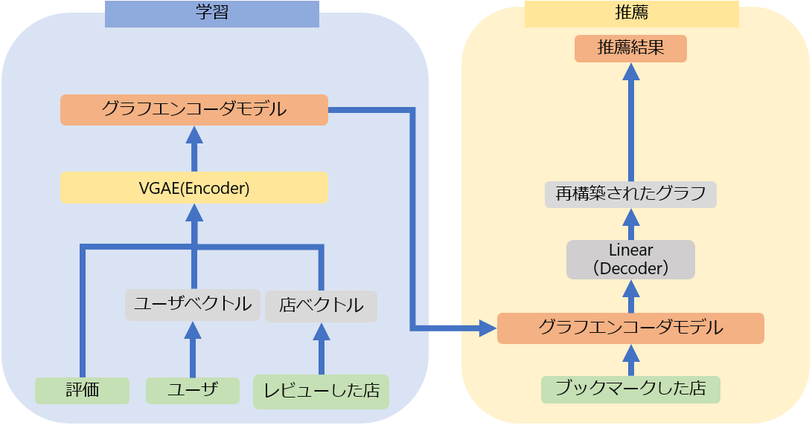

# グルメコンサル
食べログのデータをもとにレストラン検索機能、推薦機能があるアプリ  
- 検索機能  
　「甘い」や「ゆっくり」などジャンル以外の抽象的な検索に対応  
   複数ワード検索にも対応  
- 推薦機能  
    ユーザの行ったことのある店のレビューにもとづいて推薦  
## コンセプト
- レストラン検索をジャンル以外で検索
- レストランについて受動的に情報を知りたい

## 開発環境
- python3.9
- anaconda-4.12.0
- React
- Material UI
## システム構成図
### 全体

### 検索

### 推薦

## 使用技術
- スクレイピング
- Word2vec
- Variational Graph Auto-Encoders (VGAE)

>**Note**  
>自作ライブラリとして`nlptoolsjp`を使用しています  
>詳しくは[こちら](https://github.com/ganbon/NLPtools-Library)をご覧ください。

## Author
[Twitter](https://twitter.com/g75hca)