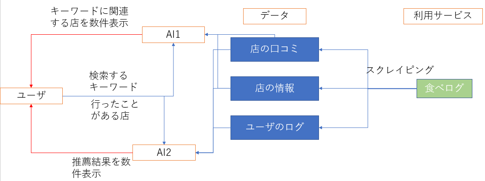
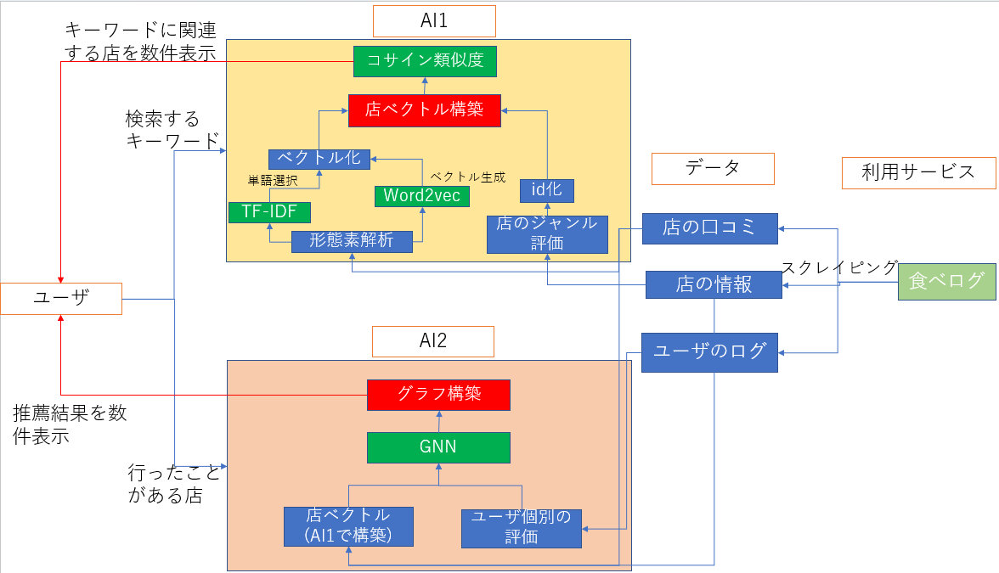

# レストラン推薦アプリ（グルメコンサルティング(仮)）

## 概要
検索機能に使える単語の多様性、または精度を上げる
（現在の食べログの検索機能は単語一致による検索だと推測）  
ユーザのログによる傾向推薦

## データ
- 食べログの口コミ  
- 食べログのユーザが訪れた店のログ  

## 使う技術
- tf-idf(口コミの重要単語抽出)
- word2vec(口コミの単語ベクトル生成)
- GNN(新規店の推薦)

## 想定データ
- 300ユーザによるいった店とその評価
- 店の口コミとジャンルと評価

## 手法
- GNNで店とユーザとの結びつきを学習
- 店のベクトルを`td-idf`による単語選択したものを`word2vec`でベクトル化する
## 評価方法
- 
- 実際に使ってもらって評価を聞く

## 計画

|  内容  |  アウトプット  |  期限  |
|  ---- |     ----     |  ----  |
|  データをスクレイピング |     jsonファイル     |  12/15  |
|  td-idfで単語を選択 |     csvファイル     |  12/16  |
|  word2vecでベクトル化 |     モデルファイル     |  12/20  |
|  GNN構築 |     pythonファイル     | 12/30  |
|  モデルを動かす |     ----     |  1/10  |
|  モデル改善 |     pythonファイル     |  1/15  |
|  フロント構築 |     pythonファイル,html,cssファイル     |  1/20  |
|  発表資料 |     powerpoint     |  1/21  |
|  発表練習 |    ----     |  1/22  |

## 利用ライブラリ
- MeCab
- 
## ユースケース

## システム構成

  